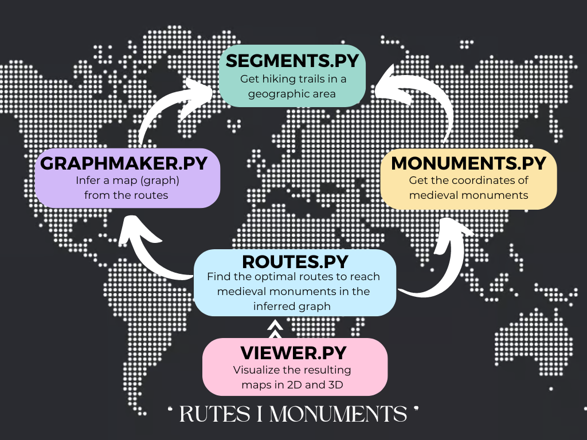

# Routes and Monuments Application

This project is an application that involves an analysis of geographic information coordinates and aims to dive into GPS trajectory data, map interference and optimal route finding.

The main objectives to achieve are:

-  **Hiking routes obtention:**

    The first part consists of acquiring GPS trajectory data from hiking routes in specific geographic areas. 
    This dataset consists of the fundamental input for subsequent parts of the project.

- **Map generation:**

    The collected trajectory data is then used in order to infer a map employing sophisticated algorithms and libraries that make the graph structure represetnation possible.

- **Medieval monuments and optimal routes identification**

    Additionally, once the map of hiking routes is obtained, it can be used to find optimal routes to reach all the medieval monuments. It involves the extraction of medieval landmarks coordinates from the Catalunya Medieval database, which enables the creation of an efficient route from a given starting point.
    Graph-based algorithms are needed to achieve it. As well as a good analysis of factors such as distance or accessibility, among others. 

- **Visualization in 2D and 3D**

    In order to enhance the user's experience, the project offers a representation of the resulting maps in both two-dimensional (2D) and, to provide a more immersive experience, three-dimensional (3D) representations. These approaches enrich the environment and space comprehension, providing users with intuitive insights into the geographic zone of interest.

## Structure and Design Decisions


### Segments Module

The 'Segments' module is the base for the program. It is in charge of downloading data and gathering information about it in order to clean it and get the desired walkable paths.  

#### Data Structures
- **Point:** 
    
    Represents a geographical location using latitude and longitude coordinates.
    
- **Segments:** 
    
    Represents a portion of a path represented by a starting and an ending point (both of type Point)

- **Region:** 
    
    Rectangular area defined by the bottom-left and top-right diagonally opposite corners (both of type Point)

- **Segment_to_clean:** 
    
    It is an internally used class during data cleaning. It includes the starting and ending points (both of type Point) and their corresponding timestamps (t1, t2).

- **Data and Segments (aliases):** 
    
    They both represent a list of objects. The former one is used to store unprocessed downloaded segments, and the Segments is used for cleaned segments after processing.

#### Functions 
- **get_segments:** 
    
    It is the main function of the module. First, it checks if the given file (filename) exists. If it does, it assumes that you already have the desired segments from the given region downloaded and cleaned. 
    If there's no file, it does the desired procedure in order to get it.
    It returns a list of the cleaned segments that will be used to create the routes. 

- **_get_data:**
    
    Given the specified region, it collects data of walking paths from OpenStreetMap. It firts sorts points by time, and it stores them as segments in a list with their corresponding timestamps for further processing.

- **Data validity:**
    
    Segments module employs data validation functions in order to ensure the quality and consistency of the collected segments.
    
    **Temporal Consistency:** 
    
    Segments where timestamps for its consecutive points represent different days are discarted. These points are considered from different routes, as some assumptions based on typical walking patterns have been made: 
        - Users are unlikely to take walks spanning midnight 
        - Long-distance walks extending into days are also discarted 

    **Spatial Consistency:** 
    
    We decided not to base our conclusions on distance because two consecutive routes might end and begin at the same location, leading to the creation of an unrealistic segment.
    A maximum distance threshold is implemented (100 meters). Segments exceeding this distance are ruled out.
    The information is gathered using a receiver that tracks the user's position and stores it every x seconds, depending on how the receiver has been configured. As a consequence, the spatial consistency could be affected. The same happens for GPS signal loss or inaccuracies, which could lead to inconsistent jumps in recorded locations. 
    **_valid_distance and _valid_segment:** functions used to check the consistency of the collected data. 

- **Saving and Loading**:
    **_write_segments_to_file:** after data validation and cleaning, it writes the valid segments from the data list to a file (filename). 
    **_load_segments:** it reads the segments stored in the specified file (filename). It transforms it into a list of Segment objects.  

### Monuments Module 

The 'monuments' module is responsible for downloading information about medieval monuments from Catalonia, which later will be used to obtain optimal routes to them.

#### Data Structures
- **Monument:** 
    Represents a medieval monument with its name and location. 

#### Functions 
- **get_monuments:** 

    It is the base of the module. First, it checks if it exists a filename called as the string it recieves. If it does, it returns a list with every monument (name and location) of Catalonia.  
    If there is no file, it downloads the monuments data from 'Catalunya Medieval' website and write it in a file. 

- **selected_monuments_in_region:**

    It filters all the monuments from a file, and it returns the ones that are in a specified region. 

### Graphmaker Module

The 'graphmaker' module transforms the downloaded paths (represented by Segments from the previous module) into a connected graph, enabling further exploration of real walking routes. 
The clustering process and edge analysis are the key to understand how a simplified but more representative version of the path is obtained. 
Furthermore, it creates a tree with the routes from a starting point to all the reachable monuments.

#### Functions
- **Graph creation (make_graph):** 
    
    1. Segments' unpacking: for each path, starting and ending points are extracted, and these are then represented as separated points.
    2. Clustering points: instead of using individual points, the clustering technique identifies groups of points that are close to each other and extracts its corresponding 'center of mass', the centroids. 
    3. Graph construction: using the NetworkX library, a graph is created using these centroids as nodes.
    4. Connections track: it consists of establishing connections between potentially walkable paths between these nodes. The function iterates through the cluster labels assigned to each point, and it looks for the consecutive points: if they belong to different clusters, it tracks this occurrence. 
    5. Edge Addition: according to a threshold (the minimum number of connections), only connections exceeding this are considered reliable and valid connections. Consequently, these edges are added in the graph. +

- **Graph simplification:**
    
    This part acts as the network optimization that pretends to create a more simple graph without losing relevant information.
    In order to achieve this, all the nodes of the original graph are analyzed. Given 3 nodes (g1-g2-g3) we will delete g2 if these conditions are met:
        - g2 just have 2 connected edges (neighbors)
        - The angle ($\alpha$) formed by g1g2g3 is close to 180º. In other words, if |180º-$\alpha$| < $\epsilon$
    To calculate the angle, we opted not to use the Haversine library because we have seen that the difference between using the Haversine formula and standard trigonometric operations is minimal. 

- **Create route graph:**

    For every monument of the selected ones, if there the starting point and the monument are connected it adds the edge to a new graph. At the end, this process results in a tree with the starting point as the root. 

### Viewer Module

This module, is used to export the NetworkX graph in two visual formats to see the maps in 2D and 3D format.

#### Functions
- **Static Map Image (PNG format):**
    
    It takes the graph (NetworkX format) previously created in the monuments module and creates a static map image.

-  **KML File:**
    
    Making use of simplekml library, it creates a KML file that allows the user to visualize the graph in Google Earth app. 

### Routes Module

This module returns a route from a start point to all the accessible monuments in a certain region. 

#### Functions
- **find_routes:**

    Associates the start point and every monument to a node in the graph. Moreover, checks if there is any monument accessible, if so, it prints the route and if there is not any monument returns a warning. 

- **_find_shortest_path:**
    
    Finds the shortest route between two nodes of the graph using networkx's Dijkstra algorithm. 


### Main Module 

The main module acts as the user interface in order to collect all the essential data and control the program's execution.  
It also incorporates mechanisms to ensure that the user-provided inputs are valid for the program's good functionality. If case of any anomalies, an appropriate error message is displayed.

- **Coordinates:**   
    
    Approximate coordinates of Catalonia region have been used in order to establish the boundaries of the app. 
    If coordinates outside Catalonia are detected when region coordinates are entered, the program notifies the error.
    The same happens if the starting point is not located within the boundaries of the selected region.

- **Filenames:**
    
    Any filename can be entered, the only condition is that the filename string contains at least one character.

- **Cluster Value:**
    
    The value must be grater than 1 because if not, no segments can be created, resulting in a single-node graph. 

- **Epsilon Value:**
    
    The epsilon value that will be used to determine when two segments should be considered as a single straight segment has been set between 0 and 25 degrees to make it sufficiently precise for the route design without losing relevant information. 

## Installation

The project relies on some libraries for its functionality. It uses a 'requirements.txt' file to manage these dependencies. 

Follow these steps to install the required libaries:
1. Open a terminal
2. Navigate to the directory containing the 'requirements.txt' file
3. To install the dependencies, run: 

    ```sh
    pip3 install -r requirements.txt
    ```

## Usage Instructions

Open a terminal and navigate to the directory containing all the modules: 'segments.py', 'graphmaker.py', 'viewer.py', 'monuments.py', 'routes.py', 'main.py'.

- To start the program run:

    ```sh
    python3 main.py
    ```
From now on, the program will guide you to provide the following information:

- **Region Coordinates:** 
    
    Type the latitude and longitude for the two opposing corners (bottom left and top right) of the region of interest in Catalonia.

- **Data file:**
    
    Specify the filename that has data about segments of the request region.

- **Clusters:**
    
    Enter the number of clusters you want, make sure that it is greater than 1. 
    Keep in mind: as more clusters, more precise results, but a slower processing.

- **Epsilon:**
    
    Choose the epsilon value that determines the tolerance for considering segments as part of a straight path. The program will not accept values greater than 25.
    Keep in mind: the smaller the epsilon, the stricter the criteria. 

- **Starting Point:**
    
    Type the latitude and longitude for your starting point. It must be located within the boundaries of your previously defined region.

- **Map Filename:**
    
    Specify the filename where you want to save the 2D and 3D maps.

After giving this information, the program will process the data. Once finished, PNG and KML files will have been created for you to visualize the resulting maps in 2D and 3D, respectively. 

## Future Improvements

Several new features and improvements can be carried out in future projects in order to make the project more consistent, efficient and user-friendly.
Here are some of the things that could be improved:

- **Monument Types**:
    
    All monuments are treated identically. Introducing a system to detect different monument categories would create a more user-friendly platform. This would allow users to filter and look for monuments based on their interests, improving their experience.

- **Travel Mode:**
    
    While this project only focuses on basic route planning, it would be good to incorporate directed routes with an optional travel guide mode. This would provide users with detailed information about their route in real-time.

- **Global Exploration:**
    
    With better algorithms the program could incorporate global datasets to enable exploration of trails and monuments for international regions.

## Authors

The project has been developed for Algorithms and Programming II subject by:
- Roger Velilla
- Aina Vila

Based on a project proposal by: 
- Laia Mogas
- Jordi Cortadella
- Pau Fernández 
- Jordi Petit


